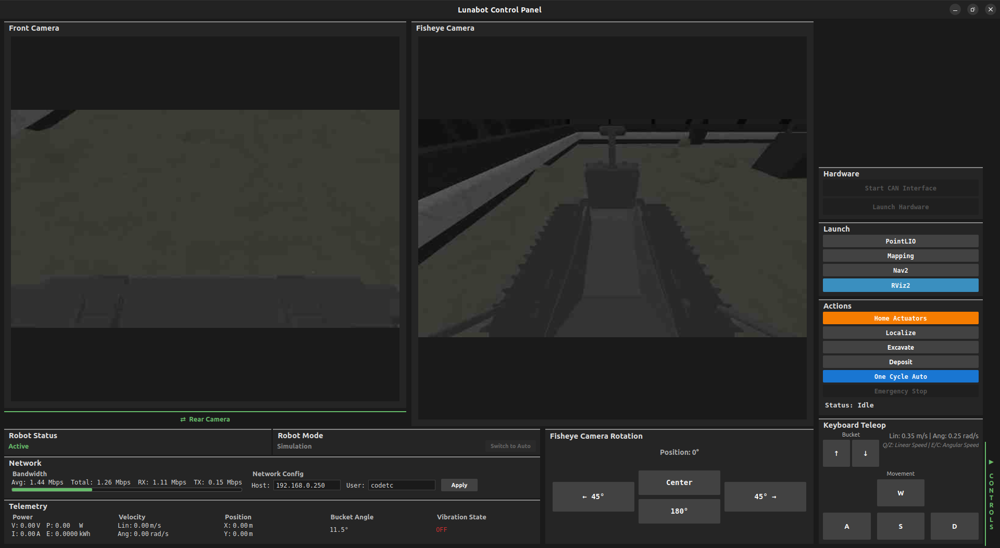
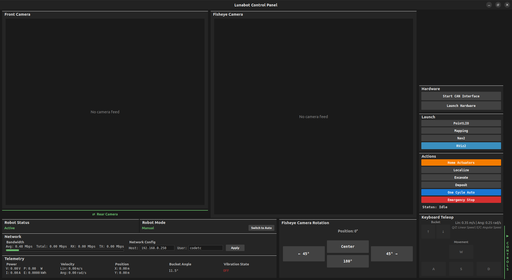

[](https://opensource.org/licenses/MIT)

# Project Overview

This repository contains the software developed by the College of DuPage team for the NASA Lunabotics competition. It is built for ROS 2 Humble on Ubuntu 22.04 for x86-64 architecture.

## System Components

**Computer**
- GMKtec NucBox G5 (Intel Alder Lake N97, 12GB RAM)

**Sensors**
- 1x Livox Mid-360
- 2x Intel RealSense D456 Depth Camera w/ IR Filter

**Hardware**
- REV Robotics NEO V1.1 (x2)
- REV Robotics Spark Max (x5)
- ODrive USB-CAN Adapter

## Installation

**You will need to have already installed ROS 2 Humble before continuing with installation. The guide can be found [here](https://docs.ros.org/en/humble/Installation/Ubuntu-Install-Debs.html). Install both `ros-humble-desktop` and `ros-dev-tools`.**

#### 1. (Optional) Append lines to .bashrc

.bashrc is a script that runs everytime a new terminal window is opened and has various configurations, environment variables, and commands for setup. There is a bug in the VSCode terminal that will cause a symbol lookup error, so you have to unset the path variable using `unset GTK_path`. If you haven't already added `source /opt/ros/humble/setup.bash` to your .bashrc file, it simply runs the setup script for ROS 2 Humble.

Sometimes Gazebo will crash on startup with the following error:
```bash
 [gzserver-3] gzserver: /usr/include/boost/smart_ptr/shared_ptr.hpp:728: typename boost::detail::sp_member_access<T>::type boost::shared_ptr<T>::operator->() const [with T = gazebo::rendering::Scene; typename boost::detail::sp_member_access<T>::type = gazebo::rendering::Scene*]: Assertion px != 0' failed.
```

To avoid this, source the `setup.bash` for Gazebo. It can also be put in the .bashrc file.

```bash
echo 'unset GTK_PATH' >> ~/.bashrc
echo 'source /opt/ros/humble/setup.bash ' >> ~/.bashrc
echo 'source /usr/share/gazebo/setup.bash '  >> ~/.bashrc
```

This will permanently append these lines to your .bashrc file, so there is no need to run it again. If you want to edit the file manually, use `nano ~/.bashrc` or `gedit ~/.bashrc` if you prefer a text editor GUI instead.

#### 2. Setup workspace and clone repository

```bash
mkdir -p ~/lunabot_ws/src
cd ~/lunabot_ws/src
git clone https://github.com/College-of-DuPage-Lunabotics/lunabot_ros.git
```

#### 3. Install dependencies

Run the installation script to install the required dependencies. `chmod +x` gives permission for the script to be executable.

```bash
cd ~/lunabot_ws/src/lunabot_ros/scripts
chmod +x install_dependencies.sh
./install_dependencies.sh
```

#### 4. (Recommended) Set MAKEFLAGS

Setting this flag to `-j1` limits each package's internal make jobs to 1 thread. You can either increase or reduce both this and `--parallel-workers`, increasing will make it build faster but may put more stress on your computer, leading to freezing.

**This will be required for many computers**, it took 64 GB of 5200MHz DDR5 RAM installed in a Lenovo LOQ 15ARP9 (AMD Ryzen 7 7435HS) to be able to build the packages without freezing while setting `"-j16"` and `--parallel-workers 16`. With this configuration, the entire workspace build took 8 minutes. The main packages that cause freezing are `rtabmap_util` and `rtabmap_sync`.

```bash
export MAKEFLAGS="-j1" # Modify number as needed
```

#### 5. Build the workspace

Building may take some time due to RTAB-Map in `third_party_packages`. Various flags such as `-DRTABMAP_SYNC_MULTI_RGBD=ON` need to be set to enable extra features for RTAB-Map such as multi-camera support.

To avoid building the entire workspace all over again after the initial build if you make changes, use `colcon build --packages-select name_of_package` and choose the package that you made changes to for rebuilding. You can list multiple packages after the `--packages-select` flag. You only need to rebuild the workspace if you modify a file for a compiled language such as `C++` or add new files, the flag `--symlink-install` will automatically reflect the changes in `Python, URDF, Xacro, and YAML` files.

```bash
cd ~/lunabot_ws
colcon build --symlink-install --cmake-args -DRTABMAP_SYNC_MULTI_RGBD=ON -DWITH_OPENCV=ON -DWITH_APRILTAG=ON -DWITH_OPENGV=OFF -DCMAKE_POLICY_VERSION_MINIMUM=3.5 --parallel-workers 1 # Modify number as needed
```

## Running the Physical Robot

### SSH Setup for Remote Operation

SSH (Secure Shell) enables remote access to the robot's onboard computer from your laptop.

#### 1. Install SSH on robot PC (host)
```bash
sudo apt update
sudo apt install openssh-server
sudo systemctl enable ssh
sudo systemctl start ssh
```

#### 2. Install SSH client on laptop (client)
```bash
sudo apt update
sudo apt install openssh-client
```

#### 3. Setup SSH key authentication (client)
```bash
# Generate SSH key (press Enter for all prompts)
ssh-keygen -t ed25519

# Get robot's IP address (run on robot PC)
hostname -I  # First address in the list

# Copy key to robot (run on laptop)
ssh-copy-id username@robot_ip

# Test connection (should not ask for password)
ssh username@robot_ip 'echo success'
```

### Configure Device Permissions (Robot PC)

#### 1. Add user to dialout group
```bash
sudo usermod -a -G dialout $USER
sudo reboot
```

#### 2. Setup camera udev rules
```bash
cd ~/lunabot_ws/src/lunabot_ros/scripts
chmod +x setup_udev_rules.sh
sudo ./setup_udev_rules.sh
```

**Note:** Unplug all cameras before running udev setup. Use `ls /dev/ttyUSB*` to verify device ports if needed.

### Basic Usage

**A detailed list of launch parameters can be found [here](lunabot_bringup/README.md).**

```bash
# Navigate to workspace and source setup
cd ~/lunabot_ws
source install/setup.bash

# Launch GUI in simulation mode (default)
ros2 launch lunabot_bringup gui_launch.py

# Launch GUI in real robot mode
ros2 launch lunabot_bringup gui_launch.py use_sim:=false
```

**For detailed GUI usage, remote operation, and configuration options, see [lunabot_gui/README.md](lunabot_gui/README.md).**

### GUI Interface

#### Simulation Mode
<p align="center">
  
</p>

#### Real Robot Mode
<p align="center">
  
</p>

