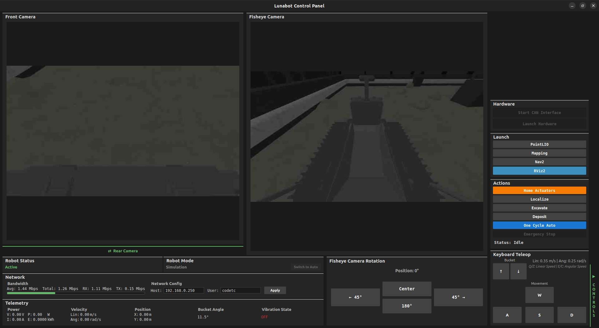
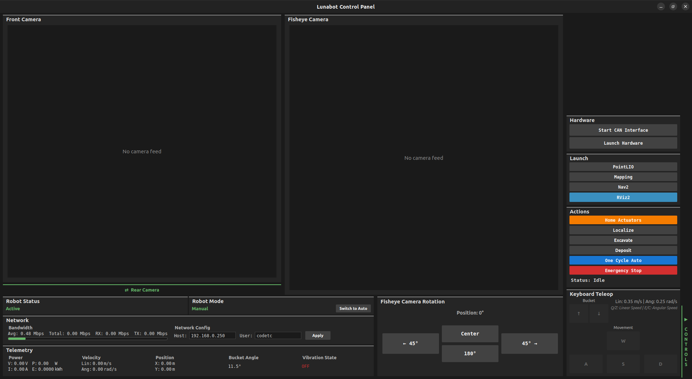

[](https://opensource.org/licenses/MIT)

# Project Overview

This repository contains the software developed by the College of DuPage team for the NASA Lunabotics competition. It is built for ROS 2 Humble on Ubuntu 22.04 for x86-64 architecture.

## System Components

**Computer**
- GMKtec NucBox G5 (Intel Alder Lake N97, 12GB RAM)

**Sensors**
- 1x Livox Mid-360
- 2x Intel RealSense D456 Depth Camera w/ IR Filter

**Hardware**
- 2x REV Robotics NEO V1.1
- 5x REV Robotics Spark Max
- 1x ODrive USB-CAN Adapter

## Packages

- [lunabot_bringup](lunabot_bringup/README.md): Launch files for GUI, simulation, hardware, and autonomy nodes.
- [lunabot_config](lunabot_config/README.md): Configuration files for Nav2, SLAM, sensors, and RViz2.
- [lunabot_description](lunabot_description/README.md): Robot URDF descriptions and meshes.
- [lunabot_gui](lunabot_gui/README.md): PyQt5 GUI for robot control and monitoring.
- [lunabot_logger](lunabot_logger/README.md): Shared logging library with colored output for C++ and Python nodes.
- [lunabot_msgs](lunabot_msgs/README.md): Custom ROS messages, actions, and services.
- [lunabot_nav](lunabot_nav/README.md): Autonomy action servers and navigation client.
- [lunabot_sim](lunabot_sim/README.md): Gazebo simulation models and world files.
- [lunabot_teleop](lunabot_teleop/README.md): Keyboard and controller teleop nodes.
- [lunabot_util](lunabot_util/README.md): Utility nodes for monitoring and image compression.
- [third_party_packages](third_party_packages/README.md): Third-party ROS packages (Livox, Point-LIO, RTAB-Map).

## Installation

**You will need to have already installed ROS 2 Humble before continuing with installation. The guide can be found [here](https://docs.ros.org/en/humble/Installation/Ubuntu-Install-Debs.html). Install both `ros-humble-desktop` and `ros-dev-tools`.**

#### 1. (Optional) Append lines to .bashrc

Appends ROS 2 and Gazebo setup scripts to .bashrc so they run in every new terminal. Also fixes a VSCode terminal bug that causes a symbol lookup error (`unset GTK_PATH`), and prevents a Gazebo startup crash.

```bash
echo 'unset GTK_PATH' >> ~/.bashrc
echo 'source /opt/ros/humble/setup.bash' >> ~/.bashrc
echo 'source /usr/share/gazebo/setup.bash' >> ~/.bashrc
```

This will permanently append these lines to your .bashrc file, so there is no need to run it again. If you want to edit the file manually, use `nano ~/.bashrc`.

#### 2. Setup workspace and clone repository

```bash
mkdir -p ~/lunabot_ws/src
cd ~/lunabot_ws/src
git clone https://github.com/College-of-DuPage-Lunabotics/lunabot_ros.git
```

#### 3. Install dependencies

Run the installation script to install the required dependencies. `chmod +x` gives permission for the script to be executable.

```bash
cd ~/lunabot_ws/src/lunabot_ros/scripts
chmod +x install_dependencies.sh
./install_dependencies.sh
```

#### 4. (Recommended) Set MAKEFLAGS

Setting this flag to `-j1` limits each package's internal make jobs to 1 thread. **This will be required for most computers**, the main packages that cause freezing are `rtabmap_util` and `rtabmap_sync`. You can increase the number to build faster at the cost of higher memory usage.

```bash
export MAKEFLAGS="-j1" # Modify number as needed
```

#### 5. Build the workspace

Building may take some time due to RTAB-Map in `third_party_packages`. Various flags such as `-DRTABMAP_SYNC_MULTI_RGBD=ON` need to be set to enable extra features for RTAB-Map such as multi-camera support.

To avoid building the entire workspace all over again after the initial build if you make changes, use `colcon build --packages-select name_of_package` and choose the package that you made changes to for rebuilding. You can list multiple packages after the `--packages-select` flag. You only need to rebuild the workspace if you modify a file for a compiled language such as `C++` or add new files, the flag `--symlink-install` will automatically reflect the changes in `Python, URDF, Xacro, and YAML` files.

```bash
cd ~/lunabot_ws
colcon build --symlink-install --cmake-args -DRTABMAP_SYNC_MULTI_RGBD=ON -DWITH_OPENCV=ON -DWITH_APRILTAG=ON -DWITH_OPENGV=OFF -DCMAKE_POLICY_VERSION_MINIMUM=3.5 --parallel-workers 1 # Modify number as needed
```

## Usage

**A detailed list of launch parameters can be found [here](lunabot_bringup/README.md).**

```bash
# Navigate to workspace and source setup
cd ~/lunabot_ws
source install/setup.bash

# Launch GUI in simulation mode (default)
ros2 launch lunabot_bringup gui_launch.py

# Launch GUI in real robot mode
ros2 launch lunabot_bringup gui_launch.py use_sim:=false
```

**For detailed GUI usage, remote operation, and configuration options, see [lunabot_gui/README.md](lunabot_gui/README.md).**

### GUI Interface

#### Simulation Mode
<p align="center">
  
</p>

#### Real Robot Mode
<p align="center">
  
</p>

## Physical Robot Setup

### SSH Setup for Remote Operation

SSH (Secure Shell) enables remote access to the robot's onboard computer from your laptop.

#### 1. Install SSH on robot PC (host)
```bash
sudo apt update
sudo apt install openssh-server
sudo systemctl enable ssh
sudo systemctl start ssh
```

#### 2. Install SSH client on laptop (client)
```bash
sudo apt update
sudo apt install openssh-client
```

#### 3. Setup SSH key authentication (client)
```bash
# Generate SSH key (press Enter for all prompts)
ssh-keygen -t ed25519

# Get robot's IP address (run on robot PC)
hostname -I  # First address in the list

# Copy key to robot (run on laptop)
ssh-copy-id username@robot_ip

# Test connection (should not ask for password)
ssh username@robot_ip 'echo success'
```

### Configure Device Permissions (Robot PC)

#### 1. Add user to dialout group
```bash
sudo usermod -a -G dialout $USER
sudo reboot
```

#### 2. Setup camera udev rules
```bash
cd ~/lunabot_ws/src/lunabot_ros/scripts
chmod +x setup_udev_rules.sh
sudo ./setup_udev_rules.sh
```

**Note:** Unplug all cameras before running udev setup. Use `ls /dev/ttyUSB*` to verify device ports if needed.
