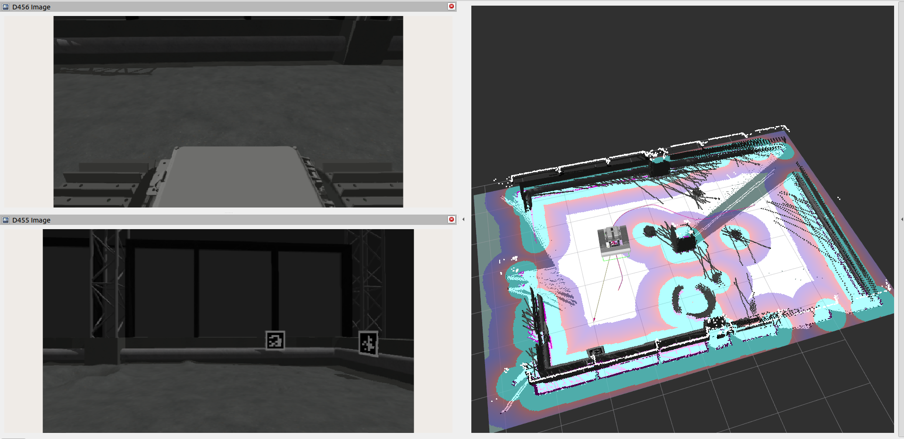

# Project Overview

This repository contains the software developed by the College of DuPage team for the 2024-2025 NASA Lunabotics competition. It is built for ROS 2 Humble on Ubuntu 22.04.

## System Components

**Computer**
- ASRock 4X4 BOX-8840U

**Sensors**
- RPLidar S3
- RPLidar S2L
- Intel RealSense D455 Depth Camera
- Intel RealSense D456 Depth Camera
  
**Hardware**
- REV Robotics NEO Vortex (x2)
- REV Robotics Spark Max (x2)
- REV Robotics Power Distribution Hub
- Turnigy 14.8V 8000mAh LiPo Battery
- Turnigy 14.8V 12000mAh LiPo Battery
- ODrive USB-CAN Adapter

## Installation

**Note: You will need to have already installed ROS 2 Humble before continuing with installation. The guide can be found [here](https://docs.ros.org/en/humble/Installation/Ubuntu-Install-Debs.html). Install both `ros-humble-desktop` and `ros-dev-tools`.**

#### (Optional) 1. Append lines to .bashrc

.bashrc is a script that runs everytime a new terminal window is opened and has various configurations, environment variables, and commands for setup. There is a bug in the VSCode terminal that will cause a symbol lookup error, so you have to unset the path variable using `unset GTK_path`. If you haven't already added `source /opt/ros/humble/setup.bash` to your .bashrc file, it simply runs the setup script for ROS 2 Humble.

```bash
echo 'unset GTK_PATH' >> ~/.bashrc
echo 'source /opt/ros/humble/setup.bash' >> ~/.bashrc
```

This will permanently append these two lines to your .bashrc file, so there is no need to run it again. If you want to edit the file manually, use `nano ~/.bashrc` or `gedit ~/.bashrc` if you prefer a text editor GUI instead.

#### 2. Setup workspace and clone repository

```bash
mkdir -p ~/lunabot_ws/src
cd ~/lunabot_ws/src
git clone https://github.com/grayson-arendt/Lunabotics-2025.git
cd Lunabotics-2025
git submodule update --init --recursive --remote
```
**If you have previously cloned this repository and do not see anything in the folders located in `lunabot_third_party` after running `git pull`, run `git submodule update --init --recursive --remote` inside the `Lunabotics-2025` folder to initialize the submodules.**

#### 3. Install dependencies

Run the installation script to install the required dependencies. `chmod +x` gives permission for the script to be executable.

```bash
cd ~/lunabot_ws/src/Lunabotics-2025/scripts
chmod +x install_dependencies.sh
./install_dependencies.sh
```

#### (Optional) 4. Install Foxglove Studio

If you would prefer to use Foxglove Studio instead of RViz2 to visualize the robot, you can install it with:
```bash
sudo snap install foxglove-studio
```

#### 5. Build the workspace

Building may take some time due to the external packages in `lunabot_third_party`. Various flags such as `-DRTABMAP_SYNC_MULTI_RGBD=ON` need to be set to enable extra features for RTAB-Map.

To avoid building the entire workspace all over again after the initial build if you make changes, use `colcon build --packages-select name_of_package` and choose the package that you made changes to for rebuilding. You can list multiple packages after the `--packages-select` flag. You only need to rebuild the workspace if you modify a file for a compiled language such as `C++` or add new files, the flag `--symlink-install` will automatically reflect the changes in `Python, URDF, Xacro, and YAML` files.

```bash
cd ~/lunabot_ws
colcon build --symlink-install --cmake-args -DRTABMAP_SYNC_MULTI_RGBD=ON -DWITH_OPENCV=ON -DWITH_APRILTAG=ON -DWITH_OPENGV=OFF --parallel-workers 1 # Modify number as needed
```

#### 6. (Optional) Set MAKEFLAG and Rebuild
If your computer keeps crashing while trying to build, `colcon build` may be trying to do too many things at once. Setting this flag to `-j1` limits each package's internal make jobs to 1 thread. You can either increase or reduce both this and `--parallel-workers`, increasing will make it build faster but may put more stress on your computer, leading to freezing.

```bash
export MAKEFLAGS="-j1" # Modify number as needed
```

Next, rebuild using the same commands in step **5. Build the workspace**.

## Simulating the Robot
The launch files have various parameters that can be set, such as changing the robot model, autonomy level, and choosing between RViz2 and Foxglove Studio for visualization. If you are using the parameter `visualization_type:=foxglove`, refer to the [Foxglove guide](https://docs.foxglove.dev/docs/connecting-to-data/frameworks/ros2/#foxglove-websocket) for connecting in the app. You can import the same layout I used by choosing `Import from file...` under the `LAYOUT` menu and selecting `foxglove_layout.json` from this directory. A detailed list of the parameters can be found in this section [here](#parameters).


There are two `robot_mode` options for simulating the robot: **manual** and **autonomous**. 

##### Manual Mode
This launches a teleop node for controlling the Gazebo robot with either a keyboard or Xbox controller along with Nav2 and RTAB-Map, but does not launch the `localization_server` or `navigation_client`. In this mode, you can drive the robot around, map the arena, and play around with setting Nav2 goals in RViz2/Foxglove Studio.

##### Autonomous Mode
This launches `localization_server` and `navigation_client` and will not allow the user to teleop the robot. Instead, it will follow the commands from the localization server and navigation client to perform a one-cycle autonomy sequence. 

#### 1. Navigate to workspace and source setup

```bash
cd ~/lunabot_ws
source install/setup.bash
```
#### Open separate terminal windows and source the workspace setup for each next step:

#### 2. Launch visualization

```bash
ros2 launch lunabot_bringup visualization_launch.py 
```

#### 3. Launch mapping and navigation

```bash
ros2 launch lunabot_bringup simulation_launch.py 
```

##### RViz2
<p align="center">
  
</p>

##### Foxglove Studio 
<p align="center">
  
</p>


## Running the Physical Robot


### SSH Into Robot Computer

SSH (Secure Shell) allows you access another device over the network and run commands. The **host computer** is the computer that you are personally interfacing with, such as laptop. For any future steps that require being ran on the robot computer, you will need to be connected via SSH.


#### 1. Install and enable SSH server (host computer):
```bash
sudo apt update
sudo apt install openssh-server

sudo systemctl start ssh
sudo systemctl enable ssh
```

#### 2. Create SSH-key (host computer)

```bash
ssh-keygen
```

#### 3. Get username and IP address (robot computer)

```bash
whoami
```
This will return the username of the robot computer, although you can also see the username just by looking at the terminal. It is the first name before the @, for example, the username would be `grayson` for `grayson@NUC`.

Next, get the IP address:
```bash
hostname -I
```

The IP address is the first set of numbers in the list.

#### 4. Establish SSH connection (host computer)

Using the username and IP address from the previous step, now you can connect to the robot computer. It may look something like this for example:

```bash
ssh asrock@192.168.10.1 # (General format: username@ip_address)
```
 It will ask you if you are sure you want to connect, type `yes`. Then, confirm by typing in the robot computer's password. 

### Configure Device Permissions 

#### 1. Add user to dialout group then restart (robot computer)

```bash
sudo usermod -a -G dialout $USER
```

Use `ls /dev/ttyUSB*` to identify device numbers if the lidars are disconnected and reconnected, then adjust the lidar `"serial_port"` parameters in `real_launch.py` accordingly.

#### 2. Setup camera udev rules (robot computer)

```bash
cd ~/lunabot_ws/src/Lunabotics-2025/scripts
chmod +x setup_udev_rules.sh
sudo ./setup_udev_rules.sh
```

Make sure all cameras are unplugged while setting up the udev rules.

### Running Launch Files

#### 1. Source workspace setup (both host and robot computer)

```bash
cd ~/lunabot_ws
source install/setup.bash
```

#### 2. Visualize with RViz2 (host computer)

```bash
ros2 launch lunabot_bringup visualization_launch.py visualization_mode:=real
```

#### 3. Launch the real robot (robot computer)

```bash
ros2 launch lunabot_bringup real_launch.py
```

### Parameters

#### real_launch.py

`robot_mode`: Selects the mode of operation.
  - Options:
    - `manual`: Runs the robot in manual mode. **(Default)**
    - `autonomous`: Runs the robot in autonomous mode.
Example: `robot_mode:=autonomous`


#### visualization_launch.py
`robot_type`: Specifies the robot model to visualize.
  - Options:
    - `bulldozer`: Visualizes the bulldozer robot. **(Default)**
    - `trencher`: Visualizes the trencher robot.

Example: `robot_type:=trencher`

`robot_orientation`: Sets the initial orientation of the robot in Gazebo.
  - Options:
    - `north`: Points the robot north.
    - `south`: Points the robot south.
    - `east`: Points the robot east. **(Default)**
    - `west`: Points the robot west.
    - `random`: Assigns a random orientation.

Example: `robot_orientation:=random`

`visualization_mode`: Specifies whether to launch Gazebo or not.
  - Options:
    - `simulation`: Launches simulated robot in Gazebo. **(Default)**
    - `real`: Only launches RViz2 or Foxglove Studio instead of Gazebo, will receive data from real hardware.

Example: `visualization_mode:=real`

`visualization_type`: Choose between RViz2 or Foxglove Studio for visualization.
- Options:
  - `rviz`: Opens visualization in RViz2. **(Default)**
  - `foxglove`: Launches Foxglove bridge to allow for connecting in the Foxglove Studio app.

Example: `visualization_type:=foxglove`

`gazebo_gui`: Enables or disables the Gazebo GUI.
- Options:
  - `true`: Runs Gazebo with its GUI. **(Default)**
  - `false`: Runs Gazebo in headless mode, may be useful if your computer has limited resources.

Example: `gazebo_gui:=false`


#### simulation_launch.py

`robot_type`: Defines which robot model parameters to use for Nav2.
  - Options:
    - `bulldozer`: Defines parameters for the bulldozer robot. **(Default)**
    - `trencher`: Defines parameters the trencher robot.

Example: `robot_type:=trencher`

`robot_mode`: Selects the mode of operation.
  - Options:
    - `manual`: Runs the robot in manual mode. **(Default)**
    - `autonomous`: Runs the robot in autonomous mode.
Example: `robot_mode:=autonomous`

`teleop_mode` : Chooses the teleoperation method.
  - Options:
    - `keyboard`: Uses keyboard for teleoperation. **(Default)**
    - `xbox`: Uses Xbox controller for teleoperation.

Example: `teleop_mode:=xbox`


## Project Structure

**lunabot_bringup**: This package contains launch files to bring up autonomy nodes, Gazebo simulation, and real world hardware.
- **launch**
  - **real_launch.py**: Launches the required nodes for bringing up the physical robot hardware and sensors, along with manual control and/or autonomy nodes.
  - **simulation_launch.py**: Launches the required nodes for simulating robot autonomy in Gazebo.
  - **visualization_launch.py**: Launches RViz2/Foxglove bridge and Gazebo to visualize the robot and its sensor data.

**lunabot_config**: This package contains configuration files for Nav2 behavior trees, RViz2 settings, and various parameters.
- **behavior_trees**
  - **nav_through_poses_w_replanning_and_recovery.xml**: A behavior tree used with Nav2 to implement behaviors like goal replanning and recovery for NavigateThroughPoses action.
  - **nav_to_pose_with_consistent_replanning_and_if_path_becomes_invalid.xml**: A behavior tree used with Nav2 to only replan when path becomes invalid to prevent Nav2 from repeatedly alternating between ambiguous paths.
- **params**
  - **gazebo**
    - **gazebo_bulldozer_bot_params.yaml**: Parameters for bulldozer style robot joint controllers in the Gazebo simulation.
    - **gazebo_trencher_bot_params.yaml**: Parameters for trencher style robot joint controllers in the Gazebo simulation.
  - **laser_filters**
    - **s2l_params.yaml**: Parameters for filtering S2L lidar scans.
    - **s3_params.yaml**: Parameters for filtering S3 lidar scans.
  - **nav2**
    - **nav2_bulldozer_bot_params.yaml**: Parameters for configuring Nav2 in simulation for the bulldozer robot.
    - **nav2_real_bot_params.yaml**: Parameters for configuring Nav2 when running on the physical robot.
    - **nav2_trencher_bot_params.yaml**: Parameters for configuring Nav2 in simulation for the trencher robot.
  - **robot_localization**
    - **ukf_params.yaml**: Parameters for the robot_localization Unscented Kalman Filter (UKF).
  - **rtabmap**
    - **rtabmap_params.yaml**: Parameters for configuring RTAB-Map.
- **rviz**
  - **robot_view.rviz**: Configuration file for RViz2 that defines what topics are visualized.

**lunabot_simulation**: This package contains assets and code for simulating the robot in Gazebo.

- **models**: Contains environmental models for the Gazebo simulation.
- **src**
  - **teleop**: Contains teleop scripts.
    - **keyboard_teleop.py**: Script for teleoping the robot using keyboard inputs.
  - **utils**: Contains utility nodes.
    - **blade_joint_controller.cpp**: Source code for controlling the bulldozer blade's joint.
    - **topic_remapper.cpp**: Remaps Gazebo controller topic names.
- **urdf**: Contains URDF descriptions.
  - **robot**
    - **real**
      - **trencher_bot.xacro**: URDF description of a high resolution real robot that utilizes a trencher digging mechanism.
    - **simulation**
      - **bulldozer_bot.xacro**: URDF description of a simulated bulldozer robot.
      - **trencher_bot.xacro**: URDF description of a simulated trencher robot.
  - **worlds**: Gazebo world files for simulating the arena, each has different rock and crater placements.
    - **high_resolution**: Contains high resolution world files.
      - **artemis**: Contains world files simulating the Artemis arena.
        - **artemis_arena.world**
        - **artemis_arena2.world**
        - **artemis_arena3.world**
    - **low_resolution**: Contains low resolution world files.
      - **artemis**: Contains world files simulating the Artemis arena.
        - **artemis_arena.world**
        - **artemis_arena2.world**
        - **artemis_arena3.world**


**lunabot_system**: This package contains various autonomy/manual controllers and utilities.
- **action**
  - **Localization.action**: Action definition for localization.
- **src**
  - **control**
    - **localization_server.cpp**: Server responsible for handling localization with AprilTags.
    - **navigation_client.cpp**: Receives localization response and sends navigation goals and triggers robot behaviors when goals are reached.
    - **robot_controller.cpp**: Converts `/cmd_vel` commands and `/joy` inputs into physical motor speed outputs.
  - **utils**
    - **hardware_monitor.cpp**: Monitors hardware topics and outputs error messages if sensor data is not received.
    - **imu_rotator.cpp**: Processes and rotates IMU data into the East-North-Up (ENU) frame.

**lunabot_third_party** This folder contains third party packages.

**scripts**: This folder contains various setup and utility scripts.
- **config**
  - **99-realsense-d4xx-mipi-dfu.rules**: Udev rules for RealSense D456 cameras.
  - **99-realsense-libusb.rules**: Udev rules for RealSense cameras using the USB interface.
- **canable_start.sh**: Sets up the CAN bus interface for motor controller communication.
- **install_dependencies.sh**: Script to install required dependencies for the robot software.
- **setup_udev_rules.sh**: Script to set up udev rules for the Intel RealSense camera.

