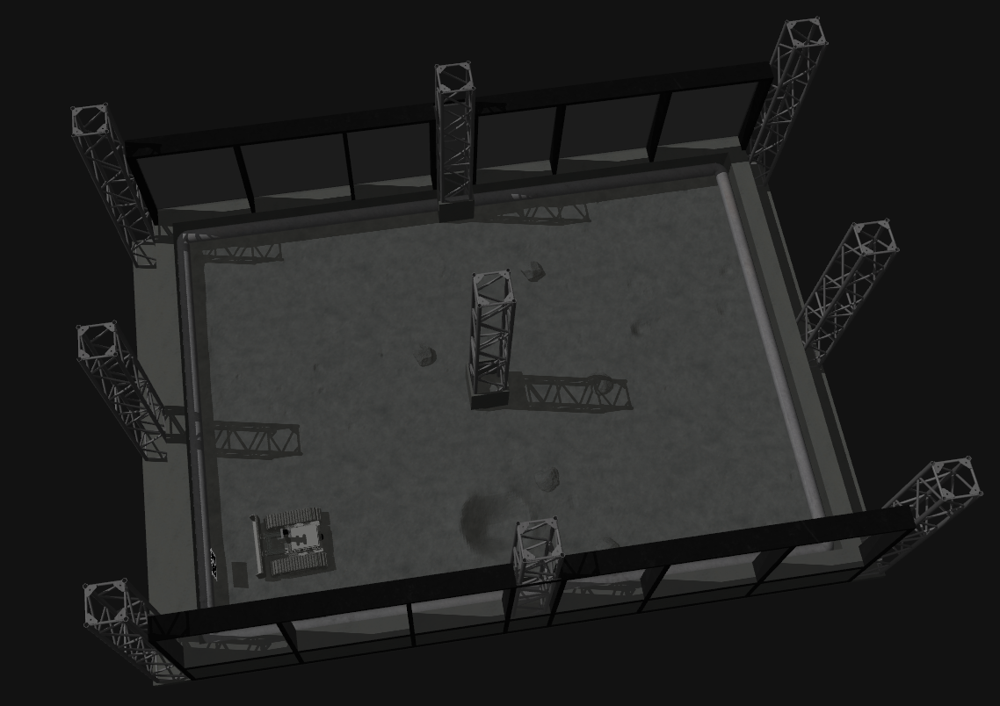

[](https://opensource.org/licenses/MIT) [](https://github.com/College-of-DuPage-Lunabotics/lunabot_ros/actions/workflows/build.yml)

# Project Overview

This repository contains the software developed by the College of DuPage team for the NASA Lunabotics competition. It is built for ROS 2 Humble on Ubuntu 22.04 for x86-64 architecture.

## System Components

**Computer**
- ASRock 4X4 BOX-8840U w/ 32GB 5200MHz DDR5 RAM

**Sensors**
- 1x Livox Mid-360
- 2x Intel RealSense D456 Depth Camera w/ IR Filter

**Hardware**
- REV Robotics NEO V1.1 (x2)
- REV Robotics Spark Max (x5)
- ODrive USB-CAN Adapter

## Installation

**You will need to have already installed ROS 2 Humble before continuing with installation. The guide can be found [here](https://docs.ros.org/en/humble/Installation/Ubuntu-Install-Debs.html). Install both `ros-humble-desktop` and `ros-dev-tools`.**

#### 1. (Optional) Append lines to .bashrc

.bashrc is a script that runs everytime a new terminal window is opened and has various configurations, environment variables, and commands for setup. There is a bug in the VSCode terminal that will cause a symbol lookup error, so you have to unset the path variable using `unset GTK_path`. If you haven't already added `source /opt/ros/humble/setup.bash` to your .bashrc file, it simply runs the setup script for ROS 2 Humble.

Sometimes Gazebo will crash on startup with the following error:
```bash
 [gzserver-3] gzserver: /usr/include/boost/smart_ptr/shared_ptr.hpp:728: typename boost::detail::sp_member_access<T>::type boost::shared_ptr<T>::operator->() const [with T = gazebo::rendering::Scene; typename boost::detail::sp_member_access<T>::type = gazebo::rendering::Scene*]: Assertion px != 0' failed.
```

To avoid this, source the `setup.bash` for Gazebo. It can also be put in the .bashrc file.

```bash
echo 'unset GTK_PATH' >> ~/.bashrc
echo 'source /opt/ros/humble/setup.bash ' >> ~/.bashrc
echo 'source /usr/share/gazebo/setup.bash '  >> ~/.bashrc
```

This will permanently append these lines to your .bashrc file, so there is no need to run it again. If you want to edit the file manually, use `nano ~/.bashrc` or `gedit ~/.bashrc` if you prefer a text editor GUI instead.

#### 2. Setup workspace and clone repository

```bash
mkdir -p ~/lunabot_ws/src
cd ~/lunabot_ws/src
git clone https://github.com/College-of-DuPage-Lunabotics/lunabot_ros.git
cd lunabot_ros
git submodule update --init --recursive --remote
```

**If you have previously cloned this repository and do not see anything in the folders located in `third_party_packages` after running `git pull`, run `git submodule update --init --recursive --remote` inside the `lunabot_ros` folder to initialize the submodules.**

#### 3. Install dependencies

Run the installation script to install the required dependencies. `chmod +x` gives permission for the script to be executable.

```bash
cd ~/lunabot_ws/src/lunabot_ros/scripts
chmod +x install_dependencies.sh
./install_dependencies.sh
```

#### 4. (Recommended) Set MAKEFLAGS

Setting this flag to `-j1` limits each package's internal make jobs to 1 thread. You can either increase or reduce both this and `--parallel-workers`, increasing will make it build faster but may put more stress on your computer, leading to freezing.

**This will be required for many computers**, it took 64 GB of 5200MHz DDR5 RAM installed in a Lenovo LOQ 15ARP9 (AMD Ryzen 7 7435HS) to be able to build the packages without freezing while setting `"-j16"` and `--parallel-workers 16`. With this configuration, the entire workspace build took 8 minutes. The main packages that cause freezing are `rtabmap_util` and `rtabmap_sync`.

```bash
export MAKEFLAGS="-j1" # Modify number as needed
```

#### 5. Build the workspace

Building may take some time due to RTAB-Map in `third_party_packages`. Various flags such as `-DRTABMAP_SYNC_MULTI_RGBD=ON` need to be set to enable extra features for RTAB-Map such as multi-camera support.

To avoid building the entire workspace all over again after the initial build if you make changes, use `colcon build --packages-select name_of_package` and choose the package that you made changes to for rebuilding. You can list multiple packages after the `--packages-select` flag. You only need to rebuild the workspace if you modify a file for a compiled language such as `C++` or add new files, the flag `--symlink-install` will automatically reflect the changes in `Python, URDF, Xacro, and YAML` files.

```bash
cd ~/lunabot_ws
colcon build --symlink-install --cmake-args -DRTABMAP_SYNC_MULTI_RGBD=ON -DWITH_OPENCV=ON -DWITH_APRILTAG=ON -DWITH_OPENGV=OFF -DCMAKE_POLICY_VERSION_MINIMUM=3.5 --parallel-workers 1 # Modify number as needed
```

## Simulating the Robot
The launch files have various parameters that can be set, such as changing the robot model and autonomy level.

**A detailed list of the launch parameters can be found [here](lunabot_bringup/README.md).**

#### 1. Navigate to workspace and source setup

```bash
cd ~/lunabot_ws
source install/setup.bash
```
#### Open separate terminal windows and source the workspace setup for each next step:

#### 2. Launch visualization

```bash
ros2 launch lunabot_bringup viz_launch.py
```

#### 3. Launch mapping and navigation

```bash
ros2 launch lunabot_bringup sim_launch.py
```

#### Gazebo
<p align="center">
  
</p>

#### RViz2
<p align="center">
  
</p>


## Running the Physical Robot

### SSH into Robot Computer

SSH (Secure Shell) allows you to access another device over the network and run commands. In this context:
- The **client** is your personal computer (e.g., your laptop).
- The **host** is the robot's onboard computer (e.g., ASRock 4X4 BOX-8840U).

#### 1. Install and enable SSH server (host):
```bash
sudo apt update
sudo apt install openssh-server

sudo systemctl start ssh
sudo systemctl enable ssh
```

#### 2. Install SSH client (client):

```bash
sudo apt update
sudo apt install openssh-client
```

#### 3. Create SSH-key (client)

```bash
ssh-keygen
```

#### 4. Get username and IP address (host)

```bash
whoami
```
This will return the username of the host, although you can also see the username just by looking at the terminal. It is the first name before the @, for example, the username would be `asrock` for `asrock@asrock-main`.

Next, get the IP address:
```bash -->
hostname -I
```

The IP address is the first set of numbers in the list.

#### 5. Establish SSH connection (client)

Using the username and IP address from the previous step, now you can connect to the host. It may look something like this for example:

```bash
ssh asrock@192.168.10.1 # (General format: username@ip_address)
```
 It will ask you if you are sure you want to connect, type `yes`. Then, confirm by typing in the host's password.

### Configure Device Permissions

#### 1. Add user to dialout group then restart (host)

```bash
sudo usermod -a -G dialout $USER
sudo reboot
```

Use `ls /dev/ttyUSB*` to identify device numbers if the lidars are disconnected and reconnected, then adjust the lidar `"serial_port"` parameters in `real_launch.py` accordingly.

#### 2. Setup camera udev rules (host)

```bash
cd ~/lunabot_ws/src/lunabot_ros/scripts
chmod +x setup_udev_rules.sh
sudo ./setup_udev_rules.sh
```

Make sure all cameras are unplugged while setting up the udev rules.

### Running Launch Files

#### 1. Source workspace setup (both client and host)

```bash
cd ~/lunabot_ws
source install/setup.bash
```

#### 2. Connect controller and run joy node (client)

Connect your controller either through a wired or Bluetooth connection to the client.

```bash
ros2 run joy joy_node
```

#### 3. Visualize with RViz2 (client)

```bash
ros2 launch lunabot_bringup viz_launch.py use_sim:=false
```

#### 4. Launch the real robot (host)

```bash
ros2 launch lunabot_bringup real_launch.py
```